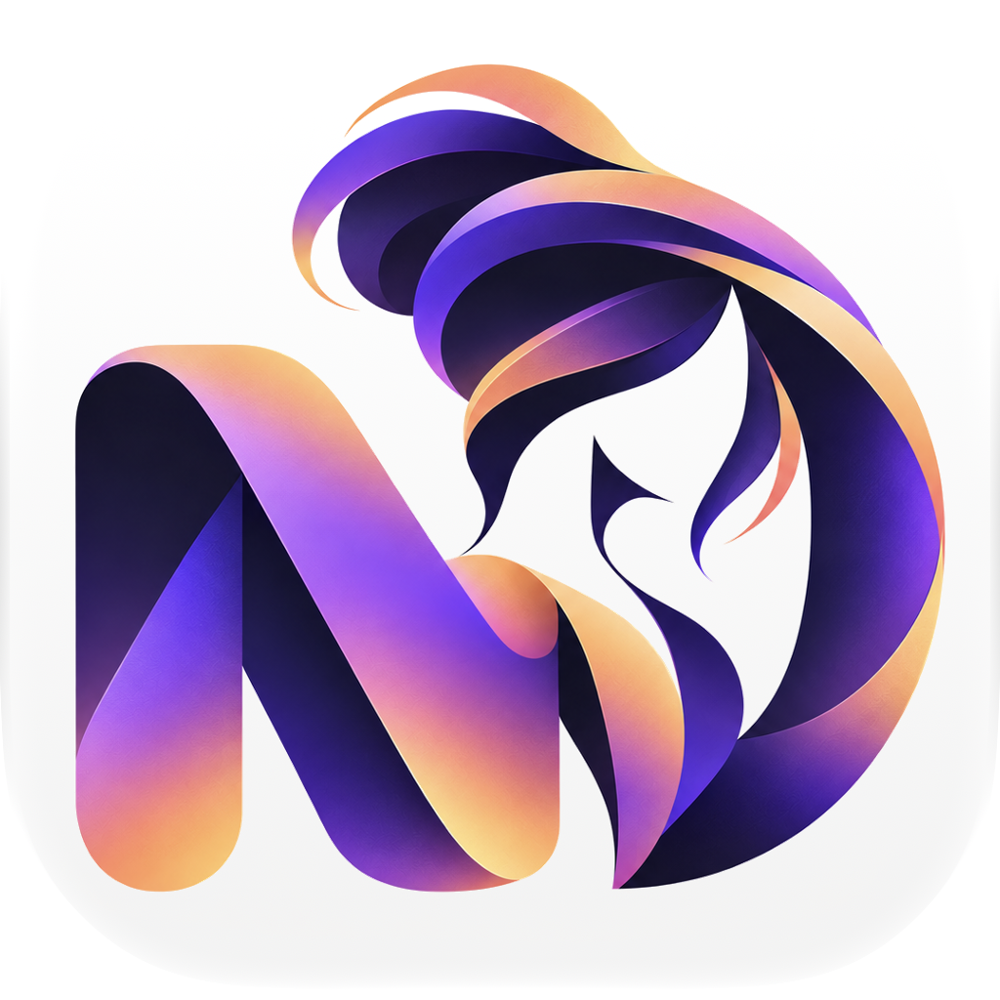

<p align="center">
  
</p>

<h1 align="center">MDonna</h1>

<p align="center">
  <strong>A native Markdown editor for macOS.</strong><br>
  Write Markdown. See the document immediately.
</p>

---

# Installation

## Install from the DMG

MDonna is distributed as a self-contained macOS disk image.

1. Download the MDonna `.dmg`.
2. Open the disk image.
3. Drag **MDonna** into **Applications**.
4. Eject the disk image.
5. Open MDonna from the Applications folder.

The packaged application is self-contained.

You do **not** need Git, Node.js, npm, Swift, Xcode, or the MDonna source repository to run the application.

### System compatibility

The current release is built for:

```text
Apple Silicon / arm64
```

It is intended for Macs using Apple Silicon processors.

### First launch and Gatekeeper

The current release is locally signed but is **not Apple-notarized**.

Because of this, macOS may block the application on its first launch.

If that happens:

1. Try to open MDonna normally.
2. Open **System Settings → Privacy & Security**.
3. Find the message concerning MDonna.
4. Choose **Open Anyway**.
5. Confirm that you want to open the application.

Depending on the macOS version, right-clicking MDonna in Finder and choosing **Open** may also provide an explicit option to launch it.

This approval is normally required only for the first launch.

---

# About MDonna

**MDonna** is a lightweight native Markdown editor for macOS.

It is built around a simple idea:

> Markdown should remain plain text, but writing it should already feel close to reading the finished document.

MDonna combines ordinary Markdown source files with an immediate, visually styled editing experience.

There is no proprietary document format.

A file edited with MDonna remains a normal `.md` file that can also be opened with another Markdown editor, a text editor, GitHub, documentation systems, static-site generators, or command-line tools.

---

# Using MDonna

## Create a new document

Use:

```text
⌘ N
```

to create a new independent document window.

MDonna supports multiple open documents at the same time.

Closing one window does not close the other open documents.

## Open a Markdown document

MDonna works with standard:

```text
.md
.markdown
```

files.

You can open a document directly from MDonna or use Finder and choose MDonna through **Open With**.

## Save a document

Use the standard macOS command:

```text
⌘ S
```

The document remains an ordinary Markdown text file.

## Close a document

Use:

```text
⌘ W
```

Only the current document window is closed.

---

# Markdown

MDonna edits ordinary Markdown directly.

For example:

```markdown
# Heading

This is **bold text** and this is *italic text*.

> A blockquote

- First item
- Second item
- Third item

[OpenAI](https://openai.com)
```

The source remains visible and editable while Markdown elements are visually styled inside the editor.

---

# Code blocks

Fenced Markdown code blocks are supported.

For example:

````markdown
```python
def hello():
    print("Hello from MDonna")
```
````

A language identifier can be placed after the opening fence for syntax highlighting.

Examples include:

```text
python
javascript
typescript
swift
bash
json
yaml
html
css
c
cpp
java
```

---

# Mathematics

MDonna renders mathematical expressions using **KaTeX**.

## Inline mathematics

Use single dollar signs:

```markdown
The relation is $E = mc^2$.
```

## Display mathematics

Use double dollar signs:

```markdown
$$
E = mc^2
$$
```

LaTeX display delimiters are also supported:

```markdown
\[
\int_0^\infty e^{-x^2}\,dx
\]
```

More complex expressions can be written directly inside Markdown:

```markdown
\[
\nabla^2 \phi =
\frac{\partial^2 \phi}{\partial x^2}
+
\frac{\partial^2 \phi}{\partial y^2}
+
\frac{\partial^2 \phi}{\partial z^2}
\]
```

The Markdown file continues to contain the original LaTeX source.

---

# Images

Standard Markdown image syntax is supported:

```markdown

```

Relative image paths are recommended when a Markdown document and its associated files should remain portable together.

For example:

```text
project/
├── notes.md
└── images/
    ├── map.png
    └── waveform.png
```

with:

```markdown

```

inside `notes.md`.

---

# Tables

Standard Markdown tables are supported:

```markdown
| Station | Distance | Phase |
|---------|---------:|-------|
| ABC     | 120 km   | P     |
| XYZ     | 245 km   | S     |
```

---

# Features

MDonna currently provides:

- a native macOS application;
- multiple independent document windows;
- standard `.md` and `.markdown` files;
- live Markdown styling;
- headings;
- bold and italic text;
- lists;
- blockquotes;
- links;
- images;
- Markdown tables;
- inline code;
- fenced code blocks;
- syntax highlighting;
- inline mathematics;
- display mathematics;
- KaTeX rendering;
- native macOS Open / Save behaviour;
- Finder **Open With** integration;
- standalone application packaging;
- DMG distribution;
- release portability validation.

---

# Building from source

The sections below are intended for developers.

## Requirements

Building MDonna currently requires:

- macOS;
- Swift;
- Swift Package Manager;
- Xcode Command Line Tools;
- Node.js;
- npm.

Check the main development tools with:

```bash
swift --version
node --version
npm --version
```

---

## Clone the repository

```bash
git clone https://github.com/foivoskar/MDonna.git
cd MDonna
```

---

## Install WebEditor dependencies

The embedded editor has its own JavaScript dependencies.

Install them with:

```bash
cd WebEditor
npm install
cd ..
```

Dependency definitions are stored in:

```text
WebEditor/package.json
WebEditor/package-lock.json
```

`WebEditor/node_modules/` is generated locally and is not stored in Git.

---

# Architecture

MDonna consists of two principal layers:

```text
Native macOS application
        +
Embedded WebEditor
```

## Native macOS layer

The native application handles:

- application lifecycle;
- document windows;
- document management;
- opening files;
- saving files;
- macOS integration;
- communication with the embedded editor.

## WebEditor

The WebEditor handles:

- Markdown editing;
- visual Markdown decorations;
- code highlighting;
- links;
- images;
- tables;
- mathematical rendering.

The WebEditor source is located under:

```text
WebEditor/src/
```

---

# Building the WebEditor

After changing files under `WebEditor/src/`, rebuild the editor with:

```bash
cd WebEditor
npm run build
cd ..
```

The generated WebEditor resources are packaged into the native application.

---

# Build scripts

MDonna separates application building, local installation, release packaging, and release validation.

## Build the application

Run:

```bash
./Scripts/build-app.sh
```

The resulting application is created at:

```text
dist/MDonna.app
```

The build script packages:

- the release executable;
- application resources;
- WebEditor resources;
- application metadata;
- Markdown document registration;
- the application icon;
- local code signing.

---

## Build and install locally

For development, run:

```bash
./Scripts/build-and-install.sh
```

This performs:

```text
build
  ↓
MDonna.app
  ↓
install into /Applications
  ↓
launch
```

The installed application is:

```text
/Applications/MDonna.app
```

---

# Building a distributable DMG

Run:

```bash
./Scripts/build-release.sh
```

The script creates the application and packages it into a standard macOS disk image.

The result is stored under:

```text
dist/
```

For the current release series, the filename has the form:

```text
MDonna-0.1-macOS-arm64.dmg
```

Opening the disk image presents the standard macOS installation layout:

```text
MDonna  →  Applications
```

The DMG contains the complete application and can be distributed independently from the source repository.

---

# Release validation

Before distributing a generated DMG, run:

```bash
./Scripts/check-release.sh
```

The release checker verifies:

- DMG integrity;
- application bundle structure;
- executable architecture;
- code signature;
- Gatekeeper status;
- dynamic-library dependencies;
- runtime search paths;
- hard-coded local development paths;
- symlinks;
- accidental development artefacts;
- execution from an unrelated temporary directory.

A successful portability check finishes with:

```text
FAIL : 0
```

Warnings concerning Gatekeeper or ad-hoc signing are expected for the current non-notarized release.

---

# Repository structure

```text
MDonna/
├── Assets/
│   └── MDonnaIcon.png
│
├── Scripts/
│   ├── build-app.sh
│   ├── build-and-install.sh
│   ├── build-release.sh
│   └── check-release.sh
│
├── Sources/
│   └── MDonna/
│       ├── MDonnaApp.swift
│       └── Resources/
│           └── WebEditor/
│
├── WebEditor/
│   ├── src/
│   │   ├── editor.js
│   │   ├── index.html
│   │   └── theme.css
│   │
│   ├── package.json
│   └── package-lock.json
│
├── Package.swift
└── README.md
```

---

# Generated files

The following are generated locally and are not source files:

```text
.build/
dist/
WebEditor/node_modules/
Backups/
install/MDonna.zip
```

They can be recreated from the repository sources and build scripts.

Generated `.app` and `.dmg` files are release/build artefacts and are not committed to the source tree.

---

# Typical development workflow

Synchronise the local repository:

```bash
git pull --rebase
```

Make the required changes.

If the WebEditor changed:

```bash
cd WebEditor
npm run build
cd ..
```

Build and install:

```bash
./Scripts/build-and-install.sh
```

Inspect the changes:

```bash
git status
```

Commit:

```bash
git add .
git commit -m "Describe the change"
```

Push:

```bash
git push
```

---

# Release workflow

Build the release:

```bash
./Scripts/build-release.sh
```

Validate it:

```bash
./Scripts/check-release.sh
```

The release pipeline is:

```text
source
  ↓
WebEditor build
  ↓
Swift release build
  ↓
MDonna.app
  ↓
local code signing
  ↓
DMG
  ↓
release validation
  ↓
distribution
```

---

# Design philosophy

## Markdown stays Markdown

MDonna does not replace Markdown with a proprietary document format.

The document stored on disk remains readable plain text.

## Source and presentation belong together

Markdown is useful because its structure is explicit and portable.

MDonna keeps that structure while providing immediate visual interpretation.

## Opening another document should be trivial

Creating another document should require nothing more than:

```text
⌘ N
```

Multiple documents can remain open independently.

## The application should remain focused

MDonna is not intended to be a full IDE, cloud platform, proprietary knowledge-management system, or closed document ecosystem.

It is a focused native Markdown editor.

---

# Current status

MDonna is an actively developed native Markdown editor for Apple Silicon Macs.

The current build supports Markdown editing, multiple independent windows, code syntax highlighting, mathematical expressions with KaTeX, images, tables, native file handling, application packaging, DMG creation, and release portability validation.

Current distributed builds are ad-hoc signed and are not Apple-notarized.

---

<p align="center">
  <strong>MDonna</strong><br>
  Plain Markdown in. Readable document immediately.
</p>
